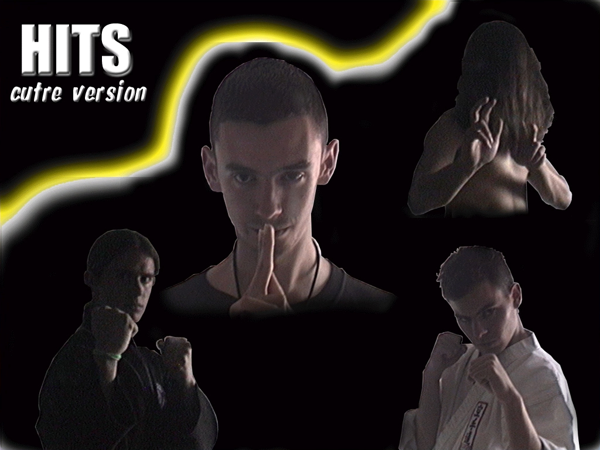
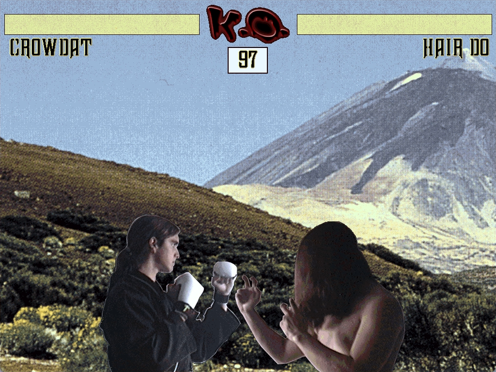
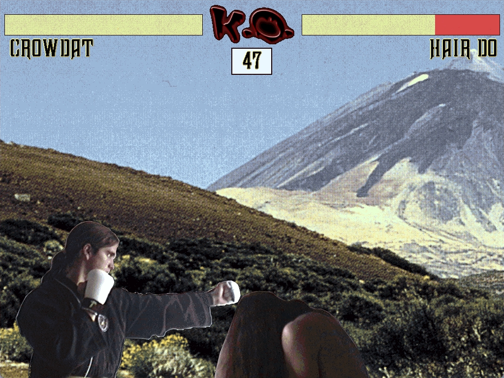

# HITS - A Digitized Fighting Game from 2000


> *A nostalgic piece of gaming history from 25 years ago*

## 📸 Screenshots

<div align="center">

### Title Screen

*The legendary "cutre versión" title screen featuring all 4 digitized characters*

### Gameplay


*CrowDat vs Hair-Do - Early round action with full health bars*


*Intense battle - Health bars turning red as damage accumulates*


*Jonas vs P.J. - Showing different character matchups*

</div>

## 📖 Story

Back in 2000, a group of friends spent their afternoons creating this simple but fun fighting game. Armed with a video capture card, DIV Games Studio 2, and plenty of enthusiasm, we digitized ourselves and created our own Mortal Kombat-style game.

**Development period:** May 6, 2000 - June 5, 2000
**Development style:** A few hours in the afternoons between studying and other activities
**Inspiration:** Mortal Kombat's digitized character style
**Reality:** Much more... let's say "humble" than our inspiration 😄

This wasn't an intensive month-long project - it was a fun side project made during free time, and it shows! But that's part of its charm.

## 🎮 About the Game

**HITS** is a 2-player fighting game where you can choose from 4 characters (all of them us, the developers and friends):

- **CrowDat**
- **Jonas**
- **P.J.**
- **Hair-Do**

Each character features digitized sprites captured from real people using a video capture card - a pretty cool technology for the year 2000!

### Game Features

- ⚔️ 2-player local versus mode
- 🎭 4 playable characters (all real people!)
- 🎵 4 original music tracks (S3M modules)
- ⏱️ 99-second timer per round
- 🏆 Best of 3 rounds system
- 💥 Multiple attacks and defense moves
- 🎨 Custom digitized graphics

### Controls

**Player 1:**
- `J` / `K` - Move left/right
- `A`, `S`, `D`, `Z`, `X`, `C` - Different attacks

**Player 2:**
- `←` / `→` - Move left/right
- `Insert`, `Home`, `Page Up`, `Delete`, `End`, `Page Down` - Different attacks

**General:**
- `Enter` - Start game (after character selection)
- `ESC` - Exit to menu

## 💾 Technical Information

### System Requirements
- **Original:** MS-DOS with VGA graphics
- **Modern:** DOSBox 0.74 or higher

### Technical Specs
- **Engine:** DIV Games Studio 2
- **Language:** DIV (Pascal-like)
- **Resolution:** 1024x768 (menus), 640x480 (character select), 1024x768 (gameplay)
- **Frame Rate:** 20 FPS (gameplay), 10 FPS (character select)
- **Sound:** PCM samples + S3M tracker music
- **Code:** 597 lines

### File Structure

```
Avalon/
├── HITS/
│   └── Hits.exe          # Main DOS executable (4.2 MB)
└── Genera/               # Game resources
    ├── FPG/              # Graphics files (~6 MB)
    ├── MOD/              # Music files (S3M format, ~1.7 MB)
    ├── PCM/              # Sound effects
    ├── MAP/              # Background images
    ├── FNT/              # Fonts
    └── PRG/              # Source code
        └── HITS.PRG      # Main program source
```

## 🚀 How to Play

### Option 1: Using DOSBox (Recommended)

1. Install [DOSBox](https://www.dosbox.com/download.php?main=1)
2. Run DOSBox
3. Mount the game directory:
   ```
   mount c C:\path\to\Avalon
   c:
   cd HITS
   Hits.exe
   ```

### Option 2: DOSBox Command Line

```bash
dosbox -c "mount c C:\path\to\Avalon" -c "c:" -c "cd HITS" -c "Hits.exe"
```

### DOSBox Configuration Tips

For the best experience, you might want to adjust DOSBox settings:
- `cycles=auto` or `cycles=10000` for appropriate speed
- `fullscreen=true` for immersive retro experience

## 🎵 Music Credits

The game features original music composed specifically for the game:
- **JONAS08.S3M** (696 KB)
- **JONAS11.S3M** (836 KB)
- **MOD.S3M** (124 KB)
- **HMM.S3M** (108 KB)

All tracks are in S3M (Scream Tracker 3 Module) format, a popular tracker format of the era.

## 👥 Credits

**Programming & Design:** Jordi Corrales Jiménez & friends

**Characters (Digitized Actors):**
- CrowDat
- Jonas
- P.J.
- Hair-Do

All character sprites were created by digitizing real video footage of the developers and friends - a technique popularized by Mortal Kombat.

## 📜 Source Code

The complete source code is included in `Genera/PRG/Hits/HITS.PRG`. The game is written in DIV language, which is similar to Pascal. The code includes:

- Main game loop and state management
- 2-player input handling
- Collision detection system
- Animation system (9 frames per character)
- Health bar mechanics
- Sound and music management

Feel free to explore and learn from it!

## 🕰️ Historical Context

This game was created in the year 2000, when:
- Windows ME and Windows 2000 were the latest operating systems
- DIV Games Studio 2 was a popular game creation tool in Spain
- Digitized graphics in games were still considered cutting-edge
- Most people were still using CRT monitors
- Game development tools were far less accessible than today

Creating a game with digitized characters required actual video capture hardware, which made this project quite ambitious for a group of students!

## 📝 License

This is a personal project from 2000, shared for historical and educational purposes.

Feel free to:
- Play it and enjoy the nostalgia
- Learn from the source code
- Share it with others interested in retro gaming

## 🎮 Fun Facts

- The entire game was made in just one month (with lots of other life happening in between)
- We used a real video capture card to digitize ourselves - pretty high-tech for 2000!
- The game runs at 20 FPS, which was perfectly acceptable for DOS games
- The executable is 4.2 MB - quite large for a DOS game, mostly due to the digitized graphics
- The original development paths were on the D: drive (`D:\DIV2\...`)

## 🙏 Acknowledgments

Thanks to:
- **Hammer Technologies** for creating DIV Games Studio
- Our friends and families who let us capture their embarrassing fighting poses
- The Spanish DIV community of the early 2000s
- Everyone who remembers the golden age of amateur game development

---

**Made with ❤️ and teenage enthusiasm in the year 2000**

*This project is preserved as a digital artifact of early 2000s amateur game development. It represents a moment in time when a group of friends learned programming, game design, and digital media production by actually doing it.*
